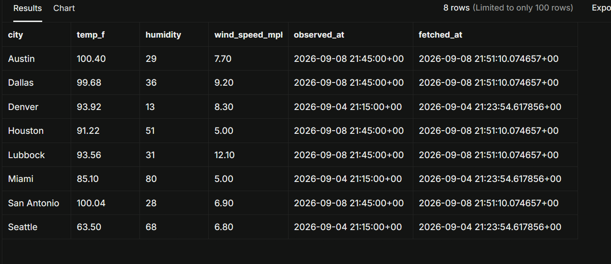
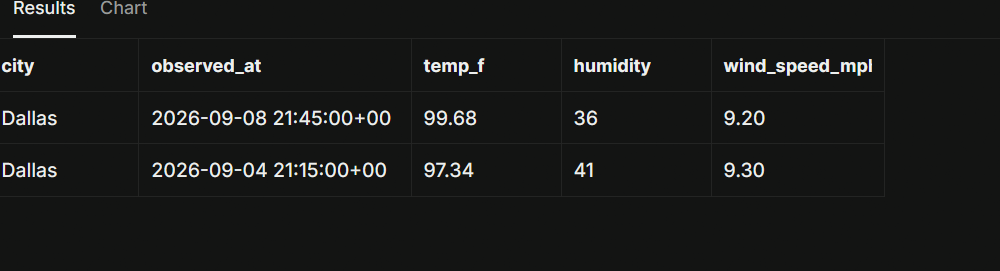

# Dynamic Weather ETL Pipeline

A production-grade, idempotent weather ETL (Extract, Transform, Load) pipeline built with Python, PostgreSQL (Supabase), and GitHub Actions. Automatically fetches live weather data via Open-Meteo REST APIs on an automated schedule and maintains a clean time-series database.

## Key Features

- **Automated CI/CD**: Runs on an automated schedule using GitHub Actions, routed through Supabase IPv4 transaction poolers (`aws-0-us-east-1.pooler.supabase.com:6543`) with encrypted GitHub Secrets.
- **Dynamic Geocoding & Extraction**: Converts city names to dynamic coordinates with request timeouts, HTTP error handling, and fault isolation.
- **Data Transformation**: Normalizes weather payloads, converts Celsius to Fahrenheit, standardizes ISO timestamps into timezone-aware UTC objects, and validates schema integrity.
- **Idempotent Time-Series Loading**: Performs bulk upserts into PostgreSQL using `psycopg2.extras.execute_values` with an `ON CONFLICT (city, observed_at) DO UPDATE` strategy to prevent duplicate observations during job retries.

## Project Structure

```text
weather-etl/
├── .github/
│   └── workflows/
│       └── etl.yml                   # GitHub Actions CI/CD pipeline schedule
├── assets/
│   └── sql_idempotency_proof.png      # Database execution & query snapshot
├── etl.py                            # Main ETL pipeline execution script
├── requirements.txt                  # Dependency declarations
├── .env                              # Local environment variables (git-ignored)
├── .gitignore                        # Git exclusion rules
└── README.md                         # Project documentation
```

## Database Schema & Time-Series Architecture

The PostgreSQL database enforces time-series data integrity using a composite primary key on `(city, observed_at)`:

```sql
CREATE TABLE IF NOT EXISTS weather_readings (
    city VARCHAR(50) NOT NULL,
    observed_at TIMESTAMP WITH TIME ZONE NOT NULL,
    temp_f NUMERIC(5, 2) NOT NULL,
    humidity INT,
    wind_speed_mph NUMERIC(5, 2),
    weather_code INT,
    fetched_at TIMESTAMP WITH TIME ZONE DEFAULT CURRENT_TIMESTAMP,
    PRIMARY KEY (city, observed_at)
);

CREATE INDEX IF NOT EXISTS idx_weather_city_observed
ON weather_readings (city, observed_at DESC);
```

## Data Integrity & Idempotency Proof

Because weather observation timestamps change hourly, re-running the pipeline within the same hour updates existing observations rather than duplicating rows.

To verify idempotency across automated GitHub Action runs, the duplicate check query below confirms zero duplicate records exist:

```sql
SELECT
    city,
    observed_at,
    COUNT(*) AS record_count
FROM weather_readings
GROUP BY city, observed_at
HAVING COUNT(*) > 1;
```


## Analytical Queries & Database Snapshots

### Current Weather Snapshot Across All Cities

```sql
SELECT DISTINCT ON (city)
    city,
    temp_f,
    humidity,
    wind_speed_mph,
    observed_at,
    fetched_at
FROM weather_readings
ORDER BY city, observed_at DESC;
```



### Historical Weather Trend for a City (e.g., Dallas)

```sql
SELECT
    city,
    observed_at,
    temp_f,
    humidity,
    wind_speed_mph
FROM weather_readings
WHERE city = 'Dallas'
ORDER BY observed_at DESC
LIMIT 24;
```



## Local Setup & Execution

1. **Clone repository**:

   ```bash
   git clone [https://github.com/YOUR_GITHUB_USERNAME/weather-etl.git](https://github.com/YOUR_GITHUB_USERNAME/weather-etl.git)
   cd weather-etl
   ```

2. **Set up virtual environment & install dependencies**:

   ```bash
   python -m venv venv
   source venv/bin/activate  # On Windows: venv\Scripts\activate
   pip install -r requirements.txt
   ```

3. **Configure Environment Variables**:
   Create a `.env` file in the root directory:

   ```env
   PG_HOST=aws-0-us-east-1.pooler.supabase.com
   PG_PORT=6543
   PG_DB=postgres
   PG_USER=postgres.YOUR_PROJECT_REF_ID
   PG_PASSWORD=YOUR_DATABASE_PASSWORD
   ```

4. **Run Pipeline**:
   ```bash
   python etl.py
   ```
